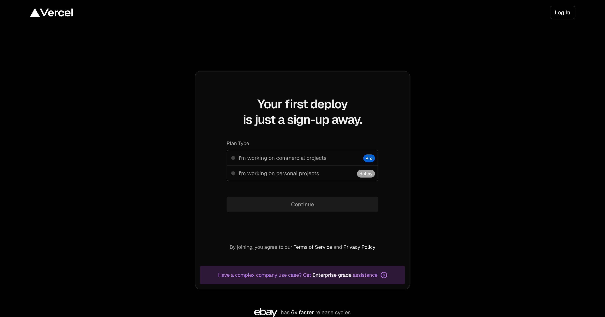
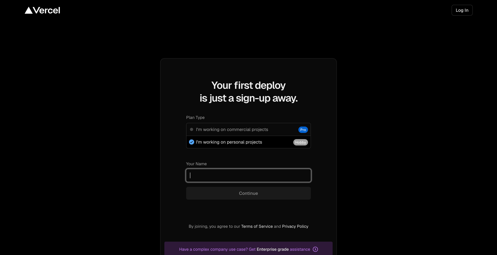
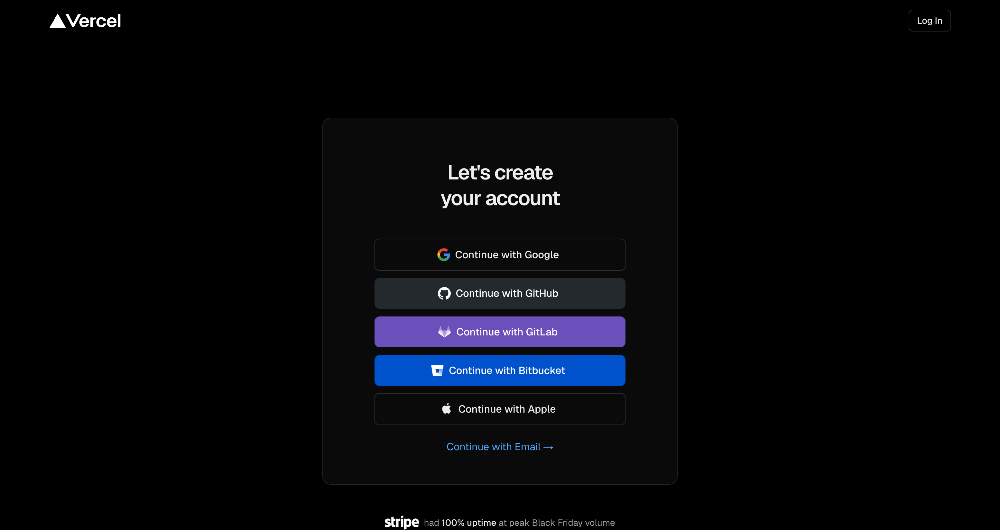

# Регистрация на Vercel — за 3 минуты

**Vercel** — бесплатная площадка для живых сайтов. Любой лендинг, one-pager или презентацию, которую собрал Дизайнер, можно выложить туда одной командой и получить настоящую ссылку типа `твой-проект.vercel.app`. Открывается с телефона, шлёшь клиентам, постишь в Telegram.

**Бесплатный план (Hobby) даёт:** неограниченные сайты, автоматические сертификаты HTTPS, живые URL, до 100 ГБ трафика в месяц. Для личного использования и небольших проектов — хватает с запасом.

Ниже — регистрация по шагам со скринами. Все экраны реальные, сняты сегодня.

---

## Шаг 1. Открыть страницу регистрации

Заходи на **[vercel.com/signup](https://vercel.com/signup)**.

Увидишь вот это:



В центре — карточка «Your first deploy is just a sign-up away» с выбором типа аккаунта. Справа вверху — кнопка «Log In» (если у тебя уже есть аккаунт, то туда; если нет — продолжаем регистрацию).

---

## Шаг 2. Выбрать тип аккаунта — Hobby (бесплатный)

В карточке два варианта:

- **I'm working on commercial projects** — платный (Pro)
- **I'm working on personal projects (Hobby)** — **бесплатный, этот и нужен**

Кликни на **Hobby**. После клика строка подсветится — так Vercel понимает что ты выбрал.


Ниже появится поле «Your Name» и кнопка «Continue».

> **Можно ли потом перейти на Pro?** Да. Аккаунт один. Если проект вырастет — меняешь план в настройках, ничего не ломается.

---

## Шаг 3. Ввести имя и нажать Continue

В поле **Your Name** пиши своё имя так, как хочешь чтобы оно отображалось. Можно по-русски, можно латиницей. Это просто подпись аккаунта, её потом можно поменять.



Нажми кнопку **Continue**. Она станет активной (чёрной) как только заполнишь имя.

---

## Шаг 4. Выбрать способ входа — 6 вариантов

Vercel просит привязать аккаунт к одному из сервисов, чтобы не хранить пароль отдельно. Видишь экран:



Варианты:

| Кнопка | Когда выбрать |
|--------|---------------|
| **Continue with Google** | **Самый простой.** Привязка к Google-аккаунту. Кликнул — подтвердил в Google — готово. Рекомендую этот путь если не разработчик. |
| **Continue with GitHub** | Если у тебя есть GitHub. Даст **важный бонус** — Vercel сможет сам подхватывать твои репозитории и деплоить их автоматически при каждом пуше. Для будущего — лучший вариант. |
| Continue with GitLab | Альтернатива GitHub — если пользуешься GitLab. |
| Continue with Bitbucket | Альтернатива GitHub — если пользуешься Bitbucket. |
| Continue with Apple | Через Apple ID. Для владельцев iPhone/Mac, кто уже залогинен в Apple. |
| Continue with Email → | Просто по почте. Vercel пришлёт на email ссылку для входа. |

## Что выбрать — моя рекомендация

**Если у тебя есть GitHub** (даже если ты его не используешь активно) — выбирай **GitHub**. Vercel автоматически увидит все твои репозитории, и ты сможешь деплоить сайты прямо из них одной командой. Это главный путь для разработчика или вайбкодера.

**Если GitHub'а нет и не хочется разбираться** — выбирай **Google**. Через 20 секунд ты в аккаунте Vercel, и из Claude Code можешь деплоить через Vercel CLI (об этом ниже).

---

## Шаг 5. Подтверждение и первый вход

После авторизации Vercel может:

- **Спросить email** (если его не было в подключённом аккаунте) — заполни тот, которым реально пользуешься.
- **Предложить подтвердить почту** — придёт письмо со ссылкой «Verify Email», нажми её.
- **Предложить создать Team** (команду) — для Hobby-плана это просто пространство твоих проектов. Имя команды — что угодно, обычно `твое-имя` или название проекта. Можно поменять потом.

После этих экранов попадёшь в **Dashboard** Vercel — чёрный интерфейс со списком проектов (пока пустой). Это и есть твой аккаунт — регистрация завершена.

---

## Шаг 6. Что дальше — подключение к офису

Чтобы твой AI-офис (Дизайнер) мог деплоить сайты прямо в Vercel, нужно один раз установить **Vercel CLI** — это инструмент в терминале, который Дизайнер будет использовать.

**Проще всего — скажи в чат офиса:**

> подключи Vercel — хочу выкладывать сайты

Офис сам проверит, установлен ли Vercel CLI, и если нет — установит одной командой. Потом откроет окно браузера для логина (одним кликом), и свяжет CLI с твоим аккаунтом. После этого Дизайнер будет деплоить твои лендинги одной фразой — *«выложи это на живой URL»*.

**Вручную** (если хочешь сам):
```bash
npm install -g vercel
vercel login
```

Первая команда устанавливает CLI, вторая — открывает браузер для логина. Выбираешь тот же способ входа (Google/GitHub/...) что и при регистрации.

---

## Частые вопросы

**— Это точно бесплатно?**
Да. Hobby-план бесплатен, без кредитной карты. Ограничения честные: 100 ГБ трафика в месяц, неограниченные сайты. Большинству хватает с запасом.

**— Что если я передумаю и захочу удалить аккаунт?**
Можно в любой момент в настройках (Settings → General → Delete Account). Все сайты отключатся, ссылки перестанут работать.

**— Привяжет ли Vercel банковскую карту?**
Не требует. Карту спросит только если сам решишь перейти на Pro-план ($20/мес).

**— Можно ли использовать один аккаунт на несколько проектов?**
Да, один аккаунт = неограниченно сайтов. Просто в Dashboard добавляешь новый проект.

**— Что делать, если Vercel не принимает email?**
Используй другой (Gmail работает идеально). Или выбери вход через Google / GitHub — там email подтянется автоматически.

---

## Что получишь в итоге

После всех шагов у тебя:

- Бесплатный аккаунт на Vercel
- Dashboard со списком (пока пустым) твоих сайтов
- Vercel CLI в терминале (после шага 6)
- Связь офиса с Vercel — Дизайнер сможет деплоить лендинги одной фразой

Дальше — собираешь с Дизайнером первый сайт и говоришь **«выложи на живой URL»**. Через 30-60 секунд получаешь настоящую ссылку, которую можно слать.
